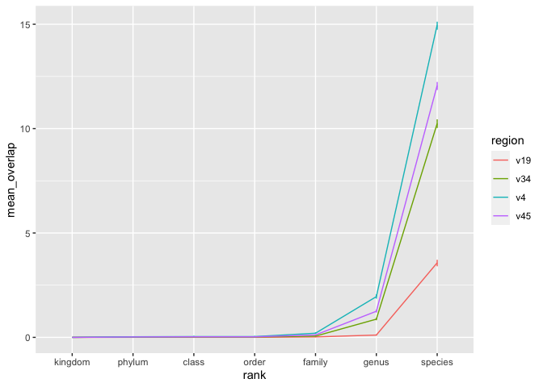

Quantifying the overlap of ESVs between taxa
================
Pat Schloss
10/21/2020

    library(tidyverse)
    library(here)
    library(knitr)

    metadata <- read_tsv(here("data/references/genome_id_taxonomy.tsv"),
                                             col_types = cols(.default = col_character())) %>%
        mutate(strain = if_else(scientific_name == species,
                                                        NA_character_,
                                                        scientific_name)) %>%
        select(-scientific_name)

    esv <- read_tsv(here("data/processed/rrnDB.easv.count_tibble"),
                                    col_types = cols(.default = col_character(),
                                                                     count = col_integer())) %>%
        filter(threshold == "esv") %>%
        select(-threshold)

    metadata_esv <- inner_join(metadata, esv, by=c("genome_id" = "genome"))

### How often is the same ESV found in multiple taxa from the same rank?

Across the analyses, we’ve already seen that a single bacterial genome
can have multiple ESVs and that depending on the species we are looking
at, there may be as many ESVs as there are genome sequences for that
species. To me this says that ESVs pose a risk at unnaturally splitting
a species and even a genome into multiple taxonomic groupings! In my
book, that’s not good.

Today, I want to ask an equally important question: If I have an ESV,
what’s the probability that it is also found in another taxonomic group
from the same rank? In other words, if I have an ESV from *Bacillus
subtilis*, what’s the probability of finding it in *Bacillus cereus*? Of
course, it’s probably more likely to find a *Bacillus subtilis* ESV in a
more closely related organism like *Bacillus cereus* than *E. coli*.
Perhaps we can control for relatedness in a future episode, but for
today, I want to answer this question for any two taxa from the same
rank.

    # set RNG seed to Pat's birthday!
    set.seed(19760620)

    get_subsample_result <- function(threshold){
        # metadata_esv - species - genome_id
        subsample_species <- metadata_esv %>%
            select(genome_id, species) %>%
        # return the distinct/unique rows
            distinct() %>%
        # group_by the species
            group_by(species) %>%
        # slice_sample on each species for N genomes
            slice_sample(n=threshold) %>%
            ungroup()

        good_species <- subsample_species %>%
        # count number of genoems in each species
            count(species) %>%
        # return species that have N genomes / filter out species with fewer than N genomes
            filter(n == threshold) %>%
            select(species)

        # going back to original list of species/genomes and return genome_ids from
        # species with N genomes

        subsampled_genomes <- inner_join(subsample_species, good_species,  by="species") %>%
            select(genome_id)

        # metadata_esv - input data
        overlap_data <- inner_join(metadata_esv, subsampled_genomes, by="genome_id") %>%
        # - focus on taxonomic ranks - kingdom to species, esv, and region
            select(-genome_id, -count, -strain) %>%
        # - make data frame tidy
            pivot_longer(cols=c(-region, -easv), names_to="rank", values_to="taxon") %>%
        # - remove lines from the data where we don't have a taxonomy
            drop_na(taxon) %>%
        # - remove redundant lines
            distinct() %>%
        # for each region and taxonomic rank, group by esvs
            group_by(region, rank, easv) %>%
        # - for each easv - count the number of taxa
            summarize(n_taxa = n(), .groups="drop_last") %>%
        # - count the number of esvs that appear in more than one taxa
            count(n_taxa) %>%
        # - find the ratio of the number of esvs in more than one taxa to the total number of esvs
            summarize(overlap = sum((n_taxa > 1) * n) / sum(n), .groups="drop") %>%
            mutate(rank = factor(rank, levels=c("kingdom", "phylum", "class", "order", "family", "genus", "species"))) %>%
            mutate(overlap = 100*overlap)

        return(overlap_data)
    }

    subsample_iterations <- map_dfr(1:100, ~get_subsample_result(threshold=1), .id="iterations")

    summary_overlap_data <- subsample_iterations %>%
        group_by(region, rank) %>%
        summarize(mean_overlap = mean(overlap),
                            lci = quantile(overlap, prob=0.025),
                            uci = quantile(overlap, prob=0.975),
                            .groups = "drop")

    # create a plot showing specificity at each taxonomic rank for each region
    # x = taxonomic rank
    # y = specificity or % of esvs found in more than one taxa
    # geom = line plot
    # different lines for each region of 16S rRNA gene

    summary_overlap_data %>%
        ggplot(aes(x=rank, y=mean_overlap, group=region, color=region, ymin=lci, ymax=uci)) +
        geom_linerange(show.legend=FALSE) +
        geom_line()

<!-- -->

    summary_overlap_data %>%
        filter(rank == "species") %>% kable(digits=1)

| region | rank    | mean\_overlap |  lci |  uci |
|:-------|:--------|--------------:|-----:|-----:|
| v19    | species |           3.6 |  3.4 |  3.7 |
| v34    | species |          10.2 | 10.0 | 10.4 |
| v4     | species |          15.0 | 14.7 | 15.1 |
| v45    | species |          12.1 | 11.9 | 12.2 |

### Conclusions

-   Sub regions are less specific at every taxonomic rank than
    full-length sequences. Still full-length has 3.6% overlap whereas
    the sub-regions are between 10.2 and 15.0% overlap
