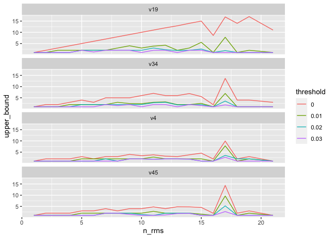

Determine the threshold needed to get 1 ASV per genome
================
Pat Schloss
11/24/2020

    library(tidyverse)
    library(here)
    library(knitr)

    set.seed(19760620)

    metadata <- read_tsv(here("data/references/genome_id_taxonomy.tsv"),
                                             col_types = cols(.default = col_character())) %>%
        select(genome_id, species) %>%
        group_by(species) %>% # Get one genome per species
        slice_sample(n=1) %>%
        ungroup()

    easv <- read_tsv(here("data/processed/rrnDB.easv.count_tibble"),
                                    col_types = cols(.default = col_character(),
                                                                     count = col_integer()))

    metadata_easv <- inner_join(metadata, easv, by=c("genome_id" = "genome")) %>%
        mutate(threshold = recode(threshold, "esv" = "0.000"),
                     threshold = as.numeric(threshold))

### Overivew

We saw earlier that a problem with E/ASVs is the risk of splitting the
operons from the same genome into multiple taxonomic groups. I would
like to determine the threshold we should use so that 95% of the genomes
are represented by a single E/ASV. \* Create a line plot of the 95th
percentile for each threshold at different number of operons per genome.
This should be faceted by region within the 16S rRNA gene. \* Create a
line plot showing the 95th percentile line for number of E/ASVs per
genome for each region when we only consider those genomes with 7 copies
of the *rrn* operon

-   Notes:
    -   Should sample 1 genome per species
    -   Is 95th percentile too strict?

<!-- -->

    easvs_by_threshold_region <- metadata_easv %>%
        
    # Aggregate data by species/genome, region, threshold, 
        group_by(region, threshold, genome_id) %>%
        
    # Count the number of E/ASVs per grouping and the # rrns per genome
        summarize(n_rrns = sum(count), n_easvs = n(), .groups="drop") %>% 
        
    # Determine the 95th percentile for each region, threshold, and # rrns
        group_by(region, threshold, n_rrns) %>%
        summarize(upper_bound = quantile(n_easvs, prob=0.95), .groups="drop")
        
    # Plot the...
    #   * 95th percentile as a function of region,  threshold, #rrns
    easvs_by_threshold_region %>%
        filter(threshold %in% c(0, 0.01, 0.02, 0.03)) %>%
        mutate(threshold = as.character(threshold)) %>%
        ggplot(aes(x=n_rrns, y=upper_bound, color=threshold)) +
        geom_line() +
        facet_wrap(~region, nrow=4)

<!-- -->

    #   * 95th percentile for the number of E/ASVs for those genomes with 7 copies 
    #     of the rrn operon
    easvs_by_threshold_region %>%
        filter(n_rrns == 4) %>%
        ggplot(aes(x=threshold, y=upper_bound, color=region)) +
        geom_line()

<!-- -->

### Conclusions…

-   Analysis depends on our comfort with uncertainty (prob=90%? 95?) and
    the number of rrn copies per genome
-   Regardless of the the number of operons or region, we need a
    significantly higher threshold than ESV or even “traditional” ASVs
    are defined at. Frankly, 3% doesn’t look so bad for this type of
    analysis.
