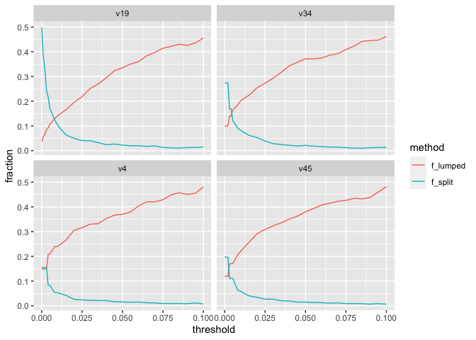
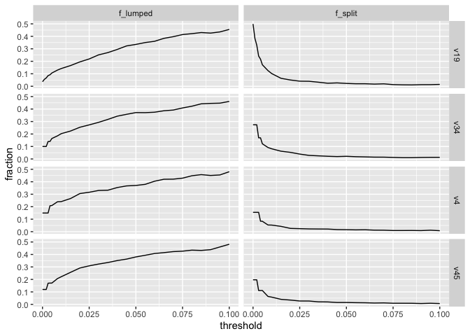

What is the effect of distance thrshold on the lumping and splitting of
bacterial species and genomes?
================
Pat Schloss
11/30/2020

    library(tidyverse)
    library(here)
    library(knitr)

    set.seed(19760620)

    metadata <- read_tsv(here("data/references/genome_id_taxonomy.tsv"),
                                             col_types = cols(.default = col_character())) %>%
        select(genome_id, species) %>%
        group_by(species) %>% # Get one genome per species
        slice_sample(n=1) %>%
        ungroup()

    easv <- read_tsv(here("data/processed/rrnDB.easv.count_tibble"),
                                    col_types = cols(.default = col_character(),
                                                                     count = col_integer()))

    metadata_easv <- inner_join(metadata, easv, by=c("genome_id" = "genome")) %>%
        mutate(threshold = recode(threshold, "esv" = "0.000"),
                     threshold = as.numeric(threshold))

### Overivew

Besides the risk of splitting a genome into multiple taxonomic groups,
there’s also the possibility that the same E/ASV can appear in multiple
species. In otherwords, by using too broad of a threshold to define an
ASV, we run the risk of lumping different species together
(e.g. *Bacillus cereus*, *B. anthracis*, and *B. thuringiensis*). I
would like to determine…

-   How often is the same E/ASV found in the multiple species?
-   What fraction of species have multiple E/ASVs?
-   Create a plot showing the fraction of species with multiple E/ASVs
    and the fraction of E/ASVs that appear in multiple species as a
    function of the threshold used to define E/ASVs.

Notes: \* Determine for each region of the 16S rRNA gene \* Select one
genome per species

    # Measuring degree of splitting...
    # Determine fraction of genomes with more than one E/ASV by region and threshold
    splitting_data <- metadata_easv %>%
        
    # - group data by region, threshold, and genome_id
        group_by(region, threshold, genome_id) %>%
    # - determine whether each genome has more than 1 E/ASV
        summarize(n_easvs = n_distinct(easv),
                            is_split = n_easvs > 1, .groups="drop") %>%
        
    # - for each region and threshold, determine the fraction of genomes with more
    #   than one E/ASV
        group_by(region, threshold) %>%
        summarize(f_split = sum(is_split) / n(), .groups="drop")

    # Measure degree of lumping...
    # Determine the fraction of E/ASVs that are found in more than one
    # genome/species
    lumping_data <- metadata_easv %>%
        
    # - group data by region, threshold, and E/ASV
        group_by(region, threshold, easv) %>%
        
    # - determine whether each E/ASV is observed in more than 1 genome
        summarize(n_genomes = n_distinct(genome_id),
                            is_lumped = n_genomes > 1, .groups="drop")  %>%
        
    # - for each region and threshold, determine the fraction of E/ASVs that appear
    #   in more than one genome
        group_by(region, threshold) %>%
        summarize(f_lumped = sum(is_lumped)/n(), .groups="drop")

    # Join lumping and splitting data
    lumping_splitting_data <- inner_join(splitting_data, lumping_data, by=c("region", "threshold")) %>%
        
    # * Tidy so that we have columns for region, threshold, lumping/splitting, and
    #   the degree of lumping and splitting
        pivot_longer(cols=c(f_split, f_lumped), names_to="method", values_to="fraction")

    # * Plot degree of lumping and splitting as a function of threshold for each
    #   region. Try faceting...
    #   - By region with lumping/splitting as separate lines
    lumping_splitting_data %>%
        ggplot(aes(x=threshold, y=fraction, color=method)) +
        geom_line() +
        facet_wrap(~region) # i like this

<!-- -->

    #   - By lumping/splitting with region as separate lines
    lumping_splitting_data %>%
        ggplot(aes(x=threshold, y=fraction, color=region)) + 
        geom_line() +
        facet_wrap(~method)

<!-- -->

    #   - By lumping/splitting and by region
    lumping_splitting_data %>%
        ggplot(aes(x=threshold, y=fraction)) +
        geom_line() +
        facet_grid(region~method)

<!-- -->

    lumping_splitting_data %>%
        ggplot(aes(x=threshold, y=fraction)) +
        geom_line() +
        facet_grid(method~region) # i like this

<!-- -->

### Conclusions…

-   As we increase the threshold, splitting drops and lumping increases
-   Again, we need a decent sized threshold (&gt;0.01) to reduce the
    level of splitting
-   Would prefer to limit splitting over lumping because species
    designations are too squishy - human made rather bacterial made
